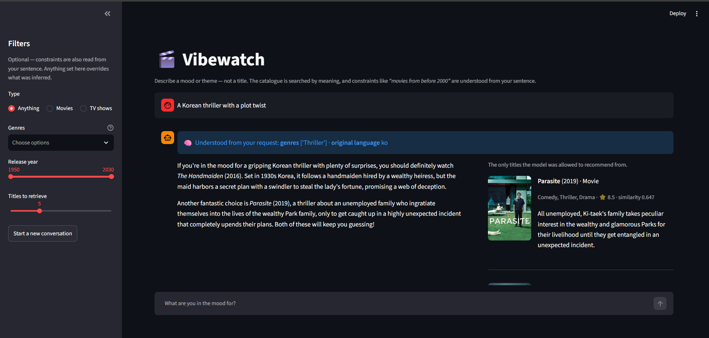

# 🎬 Vibewatch

[](https://github.com/Ahmad21Omar/Vibe_Watch/actions/workflows/tests.yml)
[](https://www.python.org/)

**A semantic recommendation system for movies & TV shows.**
Instead of searching by keywords, the user describes a *mood or theme* in natural
language (e.g. *"Survival, people fighting to stay alive"*), and Vibewatch finds the
most relevant titles via **vector similarity** and lets an LLM write a **grounded,
reasoned recommendation**.

This is a classic **RAG flow** (Retrieval-Augmented Generation):
first **retrieval** (fetch matching movies from the vector DB), then **generation**
(the LLM reasons — but *only* based on the retrieved movies, so it doesn't hallucinate).



The layout is the argument: the written recommendation sits **next to the titles it was
generated from**. A recommender that only shows prose asks you to trust it; showing the
retrieved evidence lets anyone check the answer against its sources.

Note the banner above the answer. Nobody selected a genre or a language — both were read
out of the sentence *"A Korean thriller with a plot twist"* and applied as real database
filters, and the app says so rather than narrowing the catalogue silently.

---

## 🏛️ Architecture

```
                          ┌─────────────────────────────┐
   User query             │   1. Data pipeline (TMDb)   │   (offline, one-off)
   "Survival, dark"       │   fetch movies & TV shows   │
          │               └──────────────┬──────────────┘
          │                              │
          │                              ▼
          │               ┌─────────────────────────────┐
          │               │   2. Embeddings (Gemini)     │
          │               │   text  ->  vector           │
          │               └──────────────┬──────────────┘
          │                              ▼
          │               ┌─────────────────────────────┐
          │               │   3. Qdrant (vector DB)      │
          │               │   vectors + metadata         │
          │               └──────────────┬──────────────┘
          ▼                              │
   ┌──────────────┐                      │
   │  Understand  │  mood + filters      │
   │  the request │                      │
   └──────┬───────┘                      │
          ▼                              │
   ┌──────────────┐   query vector       │
   │  Embed the   │──────────────────────┤
   │  mood        │                      ▼
   └──────────────┘        ┌─────────────────────────────┐
                           │   4. Retrieval (Top-K)       │
                           │   + metadata filters         │
                           └──────────────┬──────────────┘
                                          ▼
                           ┌─────────────────────────────┐
                           │   5. Generation (Gemini LLM) │
                           │   grounded recommendation    │
                           └──────────────┬──────────────┘
                                          ▼
                               Recommendation to the user
                        (FastAPI service -> Streamlit frontend)
```

The query flow is orchestrated with **LangGraph**, and both halves are measured:
retrieval against hand-labelled queries, generation by an LLM-as-judge.

---

## 🧰 Tech stack & rationale

| Component | Technology | Why |
|-----------|-------------|-----|
| Language | Python 3.12 | Standard for AI engineering |
| Service layer | FastAPI | Typed request/response schemas, OpenAPI docs, explicit status codes |
| Data source | TMDb API | Movies & TV shows, multilingual descriptions, free |
| Embeddings | Gemini `gemini-embedding-001` | Strong semantic quality, free tier, no local storage cost |
| Vector DB | Qdrant (Docker) | Fast similarity search, metadata filters, sparse vectors |
| Orchestration | LangGraph | Clear, traceable RAG flow modeled as a graph |
| Generation | Gemini | Grounded recommendation in natural language |
| Evaluation | hand-labelled gold set + LLM-as-judge | Measurable retrieval *and* generation quality |
| Frontend | Streamlit | Chat UI that shows the sources next to every answer |
| Deployment | Docker | Reproducible, runs anywhere |

---

## 🗺️ Roadmap

- [x] **Step 1 — Setup & foundation:** structure, venv, config, Qdrant, README
- [x] **Step 2 — Data pipeline (TMDb):** fetch and normalize movies & TV shows
- [x] **Step 3 — Embeddings & indexing:** vectorize descriptions, store in Qdrant
- [x] **Step 4 — Retrieval:** semantic search with metadata filters
- [x] **Step 5 — Generation & orchestration:** LangGraph flow + LLM reasoning
- [x] **Step 6 — Frontend & evaluation:** Streamlit UI, retrieval + faithfulness metrics,
      Docker deployment
- [x] **Step 7 — Beyond the plan:** hybrid search (built, measured, *rejected* — see
      below), query understanding with multi-turn follow-ups, and a FastAPI service layer

```bash
docker compose up -d --build                              # UI :8501, API :8000
python -m scripts.recommend "dark survival" --type movie  # the same thing, from the CLI
python -m scripts.evaluate_retrieval                      # how good is retrieval?
python -m scripts.evaluate_generation                     # is the answer faithful?
```

---

## 🚀 Setup

**Prerequisites:** Docker Desktop (and Python 3.12+ for the local dev setup).

```bash
cp .env.example .env      # then add your TMDB_API_KEY and GEMINI_API_KEY
```

Both keys are free: [TMDb](https://www.themoviedb.org/settings/api) ·
[Gemini](https://aistudio.google.com/apikey).

### Run it with Docker

```bash
docker compose up -d --build
```

| | |
|---|---|
| UI | http://localhost:8501 |
| API docs (OpenAPI) | http://localhost:8000/docs |
| Readiness | http://localhost:8000/health |
| Qdrant dashboard | http://localhost:6333/dashboard |

The index needs to be built once (see [Data pipeline](#-data-pipeline) below); until then
`/health` answers **503** and says so.

### Develop locally

```bash
python -m venv .venv
.\.venv\Scripts\activate         # Windows (PowerShell)
pip install -r requirements.txt

docker compose up -d qdrant      # just the database -- dashboard at :6333/dashboard
pytest                           # 163 tests, no keys and no services required

uvicorn vibewatch.api:app        # the service...
streamlit run app.py             # ...and the UI that talks to it
```

**The test suite deliberately needs no secrets.** API keys are optional at import and
only required at the point of use, so `git clone && pytest` is green on a machine that
has never seen an API key — which is also why [CI](.github/workflows/tests.yml) runs
without a single credential.

---

## 📁 Project structure

```
Vibewatch/
├── app.py               # Streamlit UI -- an ordinary client of the API
├── vibewatch/           # Python package with the actual code
│   ├── api.py           # FastAPI service: /recommend, /health, /genres
│   ├── client.py        # HTTP client the UI uses
│   ├── config.py        # central, type-safe configuration
│   ├── gemini.py        # shared retry policy for the Gemini API (429 / 5xx)
│   ├── bm25.py          # BM25 sparse vectors (the keyword half of hybrid search)
│   ├── models.py        # Title: our unified movie/TV data model
│   ├── tmdb.py          # thin TMDb API client
│   ├── embeddings.py    # text -> vector via Gemini (batched, rate-limited, resumable)
│   ├── embedding_cache.py  # on-disk cache so an interrupted run resumes
│   ├── vector_store.py  # Qdrant: collection, indexing, filtered search
│   ├── retrieval.py     # query -> ranked, grounded titles (the retrieval seam)
│   ├── generation.py    # prompt building + grounded LLM recommendation
│   ├── query_understanding.py  # free text -> mood + hard filters
│   ├── graph.py         # LangGraph: understand -> retrieve -> generate (+ retry)
│   ├── evaluation.py    # retrieval metrics: recall@k, MRR
│   └── judge.py         # LLM-as-judge: is the answer faithful to its sources?
├── scripts/
│   ├── fetch_titles.py  # offline ingestion: TMDb -> data/titles.json
│   ├── index_titles.py  # offline indexing: embed -> Qdrant
│   ├── recommend.py     # online: ask for a recommendation from the CLI
│   ├── evaluate_retrieval.py   # measure retrieval against the gold set
│   └── evaluate_generation.py  # measure faithfulness of the answers
├── eval/
│   └── gold_queries.json  # hand-labelled queries for retrieval evaluation
├── tests/               # fast unit tests + opt-in live integration tests
├── data/                # locally cached TMDb data (git-ignored)
├── docs/                # README assets (UI screenshot)
├── .github/workflows/   # CI: lint + tests on every push (no secrets needed)
├── .env.example         # template for API keys
├── requirements.txt     # Python dependencies (grouped by step)
├── Dockerfile           # image for the Streamlit app
├── docker-compose.yml   # the whole stack: ui + api + Qdrant
└── README.md
```

---

## 🧪 Tests

```bash
pytest                  # 163 fast, pure unit tests -- no API, no Docker, no quota
pytest -m integration   # 11 end-to-end tests against live Qdrant + Gemini (opt-in)
ruff check .            # lint (same command CI runs)
```

The default suite covers the places where a silent bug would quietly corrupt everything
downstream: the `Title` model and its `embedding_text()`, the TMDb movie/TV field mapping,
the `point_id()` idempotency guarantee that keeps re-indexing from creating duplicates,
the metadata filters, the prompt that grounds the LLM, and the graph wiring.

Two patterns make that possible without mocking the code under test. **Dependencies are
injectable** — `retrieve()` takes its client and embedder, `build_graph()` takes its
retrieval and generation functions — so tests compile the *real* graph and run the *real*
search adapter with fakes only at the boundary. And **live services are opt-in**: the
integration tests carry a marker that a bare `pytest` deselects, and skip themselves
cleanly when Qdrant or the API key is absent, so a fresh checkout stays green.

The integration suite asserts *structure*, not specific titles — which film ranks first
shifts as the TMDb catalogue changes, so pinning one would only produce a flaky test. What
it does pin is the property RAG exists for: the answer must name a title that was actually
retrieved.

---

## 📥 Data pipeline

Ingestion runs **offline**, separated from the live query path — the standard RAG
architecture (no API limits at query time, reproducible data to embed).

```bash
python -m scripts.fetch_titles     # ~900 titles -> data/titles.json
```

It fetches the most popular movies & TV shows from TMDb, unifies the differing
movie/TV field names into one `Title` model, drops titles without a plot, and
de-duplicates (popularity shifts during paging can return the same title twice).

**Design note:** we do not embed the plot alone. `Title.embedding_text()` builds
`type + title + genres + plot`, giving the vector more context for a mood/theme query
to match against. What you embed decides what you can find.

---

## 🧠 Embeddings & indexing

```bash
python -m scripts.index_titles     # embed titles -> Qdrant collection "titles"
```

Each title becomes a **3072-dimensional vector** plus a metadata payload, stored as one
Qdrant point.

Three decisions worth calling out:

- **Asymmetric embeddings.** Documents are embedded with `task_type=RETRIEVAL_DOCUMENT`,
  queries with `RETRIEVAL_QUERY`. A short mood query and a 40-word plot are different
  kinds of text; telling the model which role a text plays measurably improves retrieval.
- **Cosine distance.** It compares the *angle* between vectors and ignores their length,
  so a three-word query and a long plot are compared by meaning, not by text volume.
- **Idempotent indexing.** Point ids are `uuid5(media_type + tmdb_id)` — deterministic,
  so re-running the script updates points instead of duplicating them.

### Rate limits (and an open constraint)

The free tier enforces **two** quotas, counted **per text** rather than per API call:
100 embeddings per minute, and **1000 per day**. `embeddings.py` therefore throttles
proactively and, on a 429, honours the retry delay the server returns instead of guessing
a backoff.

**Resumable by design.** Computed vectors are checkpointed to disk after every batch
(`embedding_cache.py`), keyed by a hash of `(model, task_type, text)`. If a run is
interrupted, re-running skips everything already embedded and only calls the API for what
is new — so a crash costs at most one batch, not the whole run.

**Standing constraint:** the catalogue has 912 titles, so a single full re-index consumes
almost the entire daily quota. The index is built and cached, so this costs nothing at
query time — but it does make iterating on `embedding_text()` a once-a-day affair. The
escape hatch, if that becomes limiting: move embeddings to a local ONNX model
(`fastembed`, no PyTorch, ~300 MB, no quota) and keep Gemini for generation, where one API
call per user query is cheap. Embeddings are the bulk operation; generation is not.

---

## 🔎 Retrieval

Two different questions, deliberately answered by two different mechanisms:

| Question | Answered by | Character |
|---|---|---|
| "What *feels* like this?" | vector similarity | soft, graded, a ranking |
| "And only movies since 2015?" | metadata filter | hard, yes/no |

A vector cannot reliably express "movies only" — the embedding of a survival *movie* is
still very close to a survival *series*. Hard constraints belong in the filter, not in the
vector and not in the prompt.

```python
retrieve("dark, hopeless survival", media_type="movie", release_year_min=2015)
```

**The decision that matters here is pre-filtering.** Qdrant applies the filter *during*
the vector search, using the payload indexes created with the collection. The naive
alternative — search top-5, then discard what does not match — would return two results
where the catalogue holds two hundred matching films. That is the kind of bug that never
looks broken in production; it just quietly answers worse.

### Hybrid search: built, measured, and *not* shipped as the default

Every RAG guide recommends combining semantic search with BM25 keyword search. So it was
built — a from-scratch BM25 implementation (`vibewatch/bm25.py`, no extra dependency),
stored as Qdrant sparse vectors, fused with the dense results via **Reciprocal Rank
Fusion**. Then it was evaluated against the gold set, on an identical index:

| Mode | recall@5 | MRR |
|---|---|---|
| **dense** (semantic only) | **0.832** | **0.917** |
| hybrid (dense + BM25, RRF) | 0.557 | 0.715 |

**Hybrid was substantially worse, so it is not the default.** Two reasons, both specific
to this project and both worth knowing before reaching for the standard recipe:

1. **The queries are moods, not keywords.** *"Epic fantasy quest with swords and magic"*
   contains no rare term for BM25 to latch onto, so it matches generic words instead —
   "story" surfaces *Crazy Story*. RRF fuses by **rank**, so the top of a useless keyword
   list carries the same weight as the top of a good semantic one and displaces it.
2. **The lexical case was already covered.** `embedding_text()` embeds the *title* along
   with the plot, so the dense vectors handle proper nouns on their own — verified query
   by query: *Frieren*, *Nosferatu*, *Tarantino* all rank first without BM25.

The code stays in the repo, tested and runnable (`--mode hybrid`), because the comparison
is the deliverable — and because a larger corpus or plot-only embeddings would flip the
answer. **The point is not that hybrid search is bad. It is that the gold set answered a
question that intuition got wrong.**

---

## 🧠 Query understanding

*"Funny movies from before 2000"* is two requests in one sentence: a mood (**funny**) and
two hard constraints (**movies**, **before 2000**). A first node splits them before
anything is searched:

```
"funny movies from before 2000"
    -> search_text        "funny"          ->  embedded and searched
    -> media_type         "movie"          ->  Qdrant filter
    -> release_year_max   1999             ->  Qdrant filter
```

The constraint words leaving the search text is not cosmetic. Embedded whole, *"before
2000"* pulls the vector towards titles **about** the year 2000 instead of titles **from**
it — and constrains nothing at all:

| | Result for *"funny movies from before 2000"* |
|---|---|
| **Before** | The Truman Show (1998), **Lilo & Stitch (2025)**, Back to the Future (1985), **Shrek (2001)**, Pulp Fiction (1994) |
| **After** | The Nurse on a Military Tour (1977), Gas Pump Girls (1979), Forrest Gump (1994), Cavegirl (1985) |

Two of five results violated the stated constraint; now none can. That property — *no
title may violate a constraint the user stated* — is pinned as an integration test.

Three decisions behind it:

- **The genre vocabulary comes from the catalogue, not the model.** The real genre list is
  passed into the prompt, because a model left to itself writes "Sci-Fi" where the index
  says "Science Fiction" — a filter that silently matches nothing. Grounding the
  vocabulary is the same principle as grounding the answer.
- **Explicit filters beat inferred ones.** If the sidebar says *movies* and the sentence
  implies *series*, the click wins: it is a deliberate choice, the inference is a guess.
- **It can never take a query down.** Any failure — API error, malformed JSON, Qdrant
  unreachable while fetching genres — falls back to searching the sentence as typed.

Cost: one extra LLM call per query, before retrieval starts. That is the honest trade —
about a second of latency for requests the system otherwise could not answer at all. What
was inferred is always shown in the UI: a filter that was applied but never mentioned is
indistinguishable from a bug.

### Follow-ups

*"Something funnier"* means nothing on its own, and **retrieval has no memory** — so the
same node resolves a follow-up against the earlier turns into a request that stands alone:

| Turn | Understood as | Filters |
|---|---|---|
| *"korean series about revenge"* | `revenge` | `tv` · `ko` |
| *"something funnier"* | `revenge` | `tv` · `ko` · **`Comedy`** |
| *"space documentaries"* | `space` | `Documentary` — `ko`/`tv` **dropped** |

Both directions matter, and the second is the harder one: constraints must **carry over**
when the user did not revoke them, and must **not haunt** a genuinely new topic. Both are
pinned as integration tests.

**The conversation lives in the client, not on the server.** A LangGraph checkpointer is
the framework-native answer and would keep it here — but that makes the service stateful:
sticky sessions, no horizontal scaling without a shared store (Redis/Postgres), and a
restart drops every conversation. Passing the history in with each request keeps the API
**stateless**, which is the right default for HTTP, and puts the memory where it already
exists: the client's session. The honest cost is that the client must send its history,
and long conversations grow the request — so the API caps it.

Only the user's own words are sent, never the generated answers: they are long, would
dominate the prompt, and a follow-up refers to what was *asked*, not to what we replied.

---

## ✍️ Generation & orchestration

```
                                    hits found
    query --> [understand] --> [retrieve] ------> [generate] --> answer
                                   ^   |
                                   |   | nothing found, but filters were set
                                   |   v
                               [relax_filters]
```

The LLM is given the retrieved titles as numbered, factual blocks and told that they are
the only titles that exist. Grounding is enforced on four levels: a static system
instruction holding the rules (separate from the volatile data, and cacheable), context
blocks built by the same `Title.as_context_block()` used everywhere else, a short-circuit
that never calls the model when retrieval came back empty (with no context, anything it
writes is invented), and a test asserting the answer names a retrieved title.

The model also acts as a **re-ranker**: it is told it may skip a higher-ranked candidate,
because similarity is not the same as suitability. In a real run, *Fight Club* ranked
second for a survival query and the model correctly passed it over.

**Why a graph at all?** Honestly: a straight line of steps would not justify one — nested
function calls do that in a line. Two things earn it. The **shared state**: `understand`
writes `search_text` and `filters`, `retrieve` reads them without knowing who produced
them, `relax_filters` rewrites them and sends the flow back; threading that through call
arguments would change every signature each time a node is inserted. And the **conditional
edge**, which is where it starts paying off: Hard filters are unforgiving — "TV shows from
2024 tagged Western" easily matches nothing in a 900-title catalogue — so when a filtered
search comes back empty the flow retries once without the filters instead of giving up on
a mood it could have matched. The `relaxed` flag caps that at one retry and is surfaced to
the user, because silently ignoring what someone asked for is worse than showing nothing.

---

## 🔌 The API

```
ui (Streamlit :8501)  ──HTTP──>  api (FastAPI :8000)  ──>  qdrant (:6333)
```

```bash
curl -X POST localhost:8000/recommend -H 'Content-Type: application/json' \
     -d '{"query": "funny movies from before 2000", "limit": 3}'
```
```json
{
  "answer": "If you are looking for some classic laughs from before 2000...",
  "hits": [{ "title": "Forrest Gump", "release_year": 1994, "score": 0.631, ... }],
  "inferred_filters": { "media_type": "movie", "genres": ["Comedy"], "release_year_max": 1999 },
  "relaxed": false
}
```

| Endpoint | Purpose |
|---|---|
| `POST /recommend` | the full pipeline: understand → retrieve → generate; takes an optional `history` for follow-ups |
| `GET /health` | **readiness**, not liveness — 503 if the index is unreachable *or empty* |
| `GET /genres` | the catalogue's real genres, so a client need not hardcode a list |

**Why a service, when Streamlit could just call the pipeline — and did?**

1. **One pipeline, many clients.** Without it, every consumer needs Python, the
   dependencies, an API key and a Qdrant connection. With it, they need a URL.
2. **The failure surface becomes explicit.** A direct call fails with whatever exception
   bubbles up. Here each mode is a decided status code: **422** for a malformed request
   (derived from the schema — an empty query or `media_type: "documentary"` never reaches
   the pipeline), **503** for a dependency that is down. A client can react to that
   instead of parsing tracebacks; 503 means *retry*, 422 means *don't*.
3. **It is where operational concerns belong.** Rate limits, auth, caching, tracing and
   metrics attach to a service, not to a Streamlit script.

**The UI has no private path into the pipeline.** It imports the same HTTP client any
other consumer would use, and there is deliberately no fallback to an in-process call — a
silent fallback would let the app look healthy while the service behind it is down. The
practical benefit: the most-used part of the system is also the API's integration test.

The API and the UI run from **one image** with different commands, so the two can never
drift onto different versions of the same code.

---

## 📊 Evaluation

```bash
python -m scripts.evaluate_retrieval                  # 12 labelled queries, one embedding each
python -m scripts.evaluate_retrieval --verbose        # ...and what came back for each
python -m scripts.evaluate_retrieval --mode hybrid    # compare against hybrid search
```

Everything above measures whether the pipeline is **correct**. This measures whether it is
**good** — two different questions, and only the second one can tell you if a change to
`embedding_text()` helped.

| Metric | Current | Ceiling | What it answers |
|---|---|---|---|
| recall@5 | 0.832 | 0.958 | Of the titles we call relevant, how many made the top 5? |
| MRR | 0.917 | 1.0 | How high up is the *first* relevant hit? |

Recall is the one that matters for RAG: the generator can only recommend what retrieval
handed it, so a title missing here is unrecoverable downstream. MRR is where re-ranking
work would show up. The "ceiling" column is not decoration — several queries carry more
than five labels, so recall@5 is arithmetically capped below 1.0.

**How the labels were made, and why that limits the numbers.** They were written by hand,
then extended by *pooling*: run the retriever, judge its top 5, add what is genuinely
relevant. That is standard IR practice (TREC works this way) because nobody labels 912
titles per query — and it carries the standard bias: a title no system ever surfaces never
gets judged, so the absolute score is optimistic. **Only the delta between two runs is
trustworthy.**

The first run made the case for measuring rather than eyeballing. *"Mind-bending science
fiction that plays with reality"* scored **recall 0.00** — while returning *Black Mirror*,
*Eternal Sunshine of the Spotless Mind*, *The Prestige* and *Westworld*. The retrieval was
excellent; the labels were incomplete. The same run caught two labels that are not in the
catalogue at all and two that were simply wrong. A metric's first job is to be debugged.

### Is the answer faithful to its sources?

```bash
python -m scripts.evaluate_generation          # 4 queries
python -m scripts.evaluate_generation --json   # every claim and verdict
```

Retrieval can be scored against labels; a written paragraph cannot — there is no single
correct answer. So generation is judged instead, by an LLM, using the standard
decomposition: **break the answer into atomic claims → check each one against the context
alone → faithfulness = supported / total.** A claim that is true in the real world but
absent from the context counts as *unsupported*: the recommender was not allowed to know
it. Current score: **1.00** over four queries.

**But a judge that always says "looks fine" is worse than no judge**, so the instrument is
tested too. Fed a deliberately hallucinated answer, it must object — and does, catching
three different failure modes:

| Planted claim | Verdict |
|---|---|
| *Titanic (1997)* — a title that was never retrieved | rejected |
| *The Martian stars Matt Damon* — true in reality, absent from the context | rejected |
| *The Martian won four Oscars* — simply false | rejected |

Score: **0.00**. That case is pinned as an integration test; if it ever starts passing,
every other faithfulness number in the project becomes meaningless.

Hand-rolled rather than RAGAS on purpose: ~80 lines against one API call, the prompt stays
visible and tunable, and it avoids pulling a large LangChain dependency into a project
that talks to Gemini directly. The trade-off is honest — RAGAS is better validated and
offers more metrics; this is enough to catch a regression. And the judge is itself an LLM,
so the score is a comparable signal, not truth.

---

## 📄 License

MIT — see [LICENSE](LICENSE).
